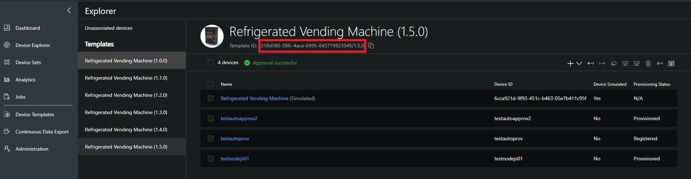

# Azure IoT Central Java SDK Documentation

[](https://gitter.im/iotdisc/community?utm_source=badge&utm_medium=badge&utm_campaign=pr-badge&utm_content=badge)
[](https://github.com/lucadruda/iotc-java-device-client/blob/master/LICENSE)

### Requirements

Java SE 8

### Targets

Java 8 supported platforms,
Android (API > 24)

## Getting started

Currently there are two ways to get the Azure IoT Central device library:
1. Include the library as a dependency in your project if your project is a managed through Maven.
2. Download the source code and build on your machine

### 1. Get Azure IoT Central SDK for Java from Maven (as a dependency)
_This is the recommended method of including the Azure IoTCentral library in your project, however this method will only work if your project works with Maven._


* Navigate to http://search.maven.org, search for **com.github.lucadruda.iotc** and take note of the latest version number (or the version number of whichever version of the library you desire to use).
* In your main pom.xml file, add the Azure IoT Device client as a dependency using your desired version as follows:
```xml
	<dependency>
        <groupId>com.github.lucadruda</groupId>
        <artifactId>iotc-java-device-client</artifactId>
        <version>2.0.0</version>
		<!--This is the current version number as of the writing of this document. Yours may be different.-->
	</dependency>
```

### 2. Build Azure IoTCentral device SDK for Java from the source code
* Get a copy of the **Azure IoTCentral SDK for Java** from GitHub (current repo). You should fetch a copy of the source from the **master** branch of the GitHub repository: <https://github.com/lucadruda/iotc-java-device-client>

```sh
	git clone https://github.com/lucadruda/iotc-java-device-client.git
```

* Open a command prompt and use the following commands:
```sh
	mvn install
```
This will compile and install both client and samples project.
If you wish to only build one or the other just specify project name:

```sh
mvn install -pl [project-name] # ('iotc-device-client' or 'iotc-device-samples')
```

The compiled JAR file with all dependencies bundled in can then be found at:
```
{IoTCentral SDK for Java root}/target/iotc-device-client-{version}-with-dependencies.jar
```
When you're ready to use the Java device SDK in your own project, include this JAR file in your project.

## API reference
* [Azure IoTCentral Device SDK](https://lucadruda.github.io/iotc-java-device-client/index.html)


### Usage

```java
import com.github.lucadruda.iotc.device.IoTCClient;
import com.github.lucadruda.iotc.device.enums.IOTC_CONNECT;

IoTCClient client = new IoTCClient(deviceId, scopeId, credType, credentials, storageManager);
```
*deviceId*   : Device ID
*scopeId*    : IoT Central Scope ID

*credType*   : IOTC_CONNECT => `IOTC_CONNECT.SYMM_KEY` or `IOTC_CONNECT.DEVICE_KEY` or `IOTC_CONNECT_X509_CERT`

*credentials*  : SAS key or x509 Certificate

*storageManager* : A storage manager to cache credentials


##### SetLogging
Change the logging level
```
client.SetLogging(logLevel);
```

*logLevel*   : (default value is `IOTC_LOGGING.DISABLED`)
```
class IOTLogLevel:
  IOTC_LOGGING.DISABLED,
  IOTC_LOGGING.API_ONLY,
  IOTC_LOGGING.ALL
```

*i.e.* => client.SetLogging(IOTC_LOGGING.API_ONLY)

##### SetGlobalEndpoint
Change the service endpoint URL
```
client.SetGlobalEndpoint(url)
```

*url*    : URL for service endpoint. (default value is `global.azure-devices-provisioning.net`)

\**call this before connect*

##### SetApiVersion
Change the provisioning service API version
```
client.SetApiVersion(apiVersion)
```

*apiVersion*    : API version for service endpoint. (default value is `2018-09-01-preview`)

\**call this before connect*

##### Connect
Connect device client. It returns if successfull or throws exception if connection fails.

```
client.Connect()
```

##### SendTelemetry
Sends telemetry

```
client.SendTelemetry(payload,[callback])
```

*payload*  : A payload object. It can be a POJO, a map or a JSON string.

i.e. `client.SendTelemetry(new Sample(24))`
where Sample is a class with public properties.

##### SendState
Sends device state

```
client.SendState(payload)
```

*payload*  : A payload object. It can be a POJO, a map or a JSON string.

i.e. `client.SendState(new Flag("on"))`
where Flag is a class with public properties.

##### SendProperty
Sends a property

```
client.SendProperty(payload)
```

*payload*  : A payload object. It can be a POJO, a map or a JSON string.

i.e. `client.SendState(new Property("value"))`
where Property is a class with public properties.`

##### Disconnect
Disconnects device client

```
client.Disconnect([callback])
```

i.e. `client.Disconnect()`

##### on
set event callback to listen events

`ConnectionStatus` : connection status has changed
`MessageSent`      : message was sent
`Command`          : a command received from Azure IoT Central
`SettingsUpdated`  : device settings were updated

i.e.
```
client.on(event, callback)
```
*event*  : IOTC_EVENTS type
```
IOTC_EVENTS.ConnectionStatus, 
IOTC_EVENTS.MessageSent,
IOTC_EVENTS.Command,
IOTC_EVENTS.SettingsUpdated
```
*callback* : IoTCentralCallback type

```
client.on(IOTC_EVENTS.SettingsUpdated, new IoTCCallback() {
            @Override
            public void Exec(Object result) {
                System.out.println("Setting: " + result);
            }
        });
```
Command management:

*after receiveing commands, it's possible to send operation progress back to the application as a property. Use the "Command" class for easy implementation*

```
client.on(IOTC_EVENTS.Command, new IoTCCallback() {

            @Override
            public void Exec(Object result) {
                Command cmd = null;
                if (result instanceof Command) {
                    cmd = (Command) result;
                }
                try {
                    client.SendProperty(cmd.getResponseObject("Executed"), null);
                } catch (IoTCentralException e) {
                    e.printStackTrace();
                }
            }
        });
```
*getResponseObject(value-to-send) returns a compatible object to be used by SendProperty*


Setting management:

*after receiveing setting, you can acknowledge successfull synchronization in the device by sending a property back to the service. Use the "Setting" class for easy implementation*

```
client.on(IOTC_EVENTS.SettingsUpdated, new IoTCCallback() {

            @Override
            public void Exec(Object result) {
                Setting setting = null;
                if (result instanceof Setting) {
                    setting = (Setting) result;
                }
                try {
                    client.SendProperty(setting.getResponseObject("Synced"), null);
                } catch (IoTCentralException e) {
                    e.printStackTrace();
                }
            }
        });
```
*getResponseObject(value-to-send) returns a compatible object to be used by SendProperty*

##### callback info class

`iotc` client callbacks are instances of `IoTCCallback` or its derivates.
Must override "Exec" method.

## One-touch device provisioning and approval (only for SAS authentication) - Preview
A device can send custom data during provision process: if a device is aware of its IoT Central template Id, then it can be automatically provisioned.

### How to set IoTC template ID in your device
Template Id can be found in the device explorer page of IoTCentral


Then initialize client passing the model and setting the right API version

_IoTCClient client = new IoTCClient(deviceId, templateId, scopeId, credType, credentials);_
_client.SetApiVersion("2019-01-15");_


### Manual approval (default)
By default device auto-approval in IoT Central is disabled, which means that administrator needs to approve the device registration to complete the provisioning process.
This can be done from explorer page after selecting the device


### Automatic approval
To change default behavior, administrator can enable device auto-approval from Device Connection page under the Administration section.
With automatic approval a device can be provisioned without any manual action and can start sending/receiving data after status changes to "Provisioned"


