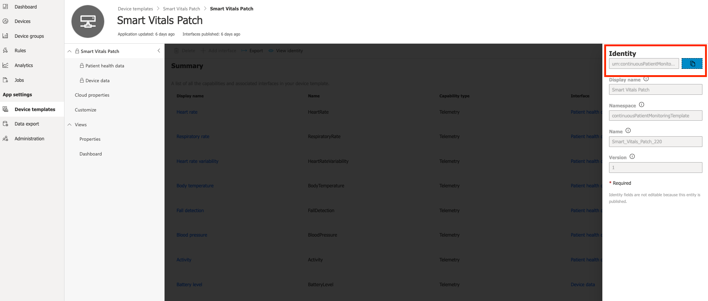
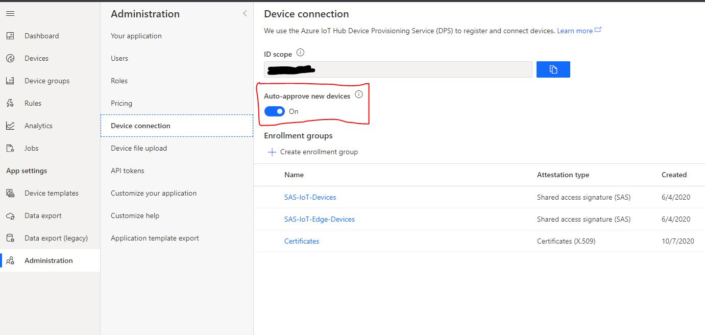

# Azure IoT Central Java SDK Documentation

[](https://maven-badges.herokuapp.com/maven-central/com.github.lucadruda/iotc-device-client)

[](https://gitter.im/iotdisc/community?utm_source=badge&utm_medium=badge&utm_campaign=pr-badge&utm_content=badge)
[](https://github.com/lucadruda/iotc-java-device-client/blob/master/LICENSE)

### Requirements

Java SE 8

### Targets

Java 8 supported platforms,
Android (API > 24)

## Getting started

Currently there are two ways to get the Azure IoT Central device library:
1. Include the library as a dependency in your project if your project is a managed through Maven.
2. Download the source code and build on your machine

### 1. Get Azure IoT Central SDK for Java from Maven (as a dependency)
_This is the recommended method of including the Azure IoTCentral library in your project, however this method will only work if your project works with Maven._


* Navigate to http://search.maven.org, search for **com.github.lucadruda.iotc** and take note of the latest version number (or the version number of whichever version of the library you desire to use).
* In your main pom.xml file, add the Azure IoT Device client as a dependency using your desired version as follows:
```xml
	<dependency>
        <groupId>com.github.lucadruda</groupId>
        <artifactId>iotc-device-client</artifactId>
        <version>2.0.0</version>
		<!--This is the current version number as of the writing of this document. Yours may be different.-->
	</dependency>
```

### 2. Build Azure IoTCentral device SDK for Java from the source code
* Get a copy of the **Azure IoTCentral SDK for Java** from GitHub (current repo). You should fetch a copy of the source from the **master** branch of the GitHub repository: <https://github.com/lucadruda/iotc-java-device-client>

```sh
	git clone https://github.com/lucadruda/iotc-java-device-client.git
```

* Open a command prompt and use the following commands:
```sh
	mvn install
```
This will compile and install both client and samples project.
If you wish to only build one or the other just specify project name:

```sh
mvn install -pl [project-name] # ('iotc-device-client' or 'iotc-device-samples')
```

The compiled JAR file with all dependencies bundled in can then be found at:
```
{IoTCentral SDK for Java root}/target/iotc-device-client-{version}-with-dependencies.jar
```
When you're ready to use the Java device SDK in your own project, include this JAR file in your project.

## API reference
Javadocs are automatically generated and available at 
Azure IoTCentral Device SDK [doc page.](https://lucadruda.github.io/iotc-java-device-client/index.html)


## Samples
A couple of samples can be found in the [samples](./iotc-device-samples) folder.

## Usage

```java
import com.github.lucadruda.iotc.device.IoTCClient;
import com.github.lucadruda.iotc.device.enums.IOTC_CONNECT;

IoTCClient client = new IoTCClient(deviceId, scopeId, credType, credentials, storageManager);
```
*deviceId*   : Device ID
*scopeId*    : IoT Central Scope ID

*credType*   : IOTC_CONNECT => `IOTC_CONNECT.SYMM_KEY` or `IOTC_CONNECT.DEVICE_KEY` or `IOTC_CONNECT_X509_CERT`

*credentials*  : SAS key or x509 Certificate

*storageManager* : A storage manager to cache credentials (see [Cache Credentials](#cache-credentials) for details);

The client also accepts custom loggers to use a different solution than console logging (default).
The provided class must implement the _ILogger_ interface.
```java
IoTCClient client = new IoTCClient(deviceId, scopeId, credType, credentials, storageManager, logger);
```

>NOTE: Instructions on connecting devices using x.509 on IoT Central [here.](https://docs.microsoft.com/en-us/azure/iot-central/core/concepts-get-connected#connect-devices-using-x509-certificates)

Most of the APIs throw _IoTCentralException_ when a failure occurs 

### Connect
```java
void client.Connect([timeout]);
```
_timeout_: optional timeout for connection in seconds.

The client provides automatic re-connection in case of network issues. If you need to definitely disconnect it, just call the _Disconnect_ method.

```java
void client.Disconnect();
```

### Send Telemetry
Sends a telemetry to IoT Central.
```java
void client.SendTelemetry(payload,[properties]);
```
- ___payload___: The telemetry object. It can be a JSON string (e.g. "{\"temperature\":23}" ) or a plain Java object (POJO).

- ___properties___: Optional object containing extra properties for the message. It can be a JSON string or a plain Java object (POJO).

### Send Property
Sends a property to IoT Central.
```java
void client.SendProperty(payload,[properties]);
```
___payload___: The property object. It can be a JSON string (e.g. "{\"fanSpeed\":120}" ) or a plain Java object (POJO).

### Client settings

#### __Set Logging level__
Change the logging level.
```java
void client.SetLogging(IOTC_LOGGING logLevel);
```

- ___logLevel___   : (default value is `IOTC_LOGGING.API_ONLY`)
``` java
class IOTLogLevel:
  IOTC_LOGGING.DISABLED, // no logs
  IOTC_LOGGING.API_ONLY, // common operations
  IOTC_LOGGING.ALL // verbose log and debug
```

#### __Set Provisioning Service endpoint (Azure DPS)__
Change the provisioning service endpoint URL
```
void client.SetGlobalEndpoint(String url)
```

***url***    : URL for service endpoint. (default value is `global.azure-devices-provisioning.net`)

> NOTE: this must be called before _Connect()_.

#### __Set connection protocol__
Set the transport protocol for both Provisioning Service and IoT Central client.
```java
public void SetProtocol(IOTC_PROTOCOL transport);
```

- ___transport___: One transport protocol between HTTPS, MQTT, AMQPS and their WebSocket mods (MQTT_WS, AMQPS_WS). 

**Default**: MQTT

> NOTE: this must be called before _Connect()_.

### Listen to properties update

```java
void client.on(IOTC_EVENTS.Properties, callback);
```
- ___callback___: Callback receiving an IoTCProperty object and triggered when a property changes in IoTCentral. Class _PropertiesCallback_ can be used for this purpose.

e.g.
```java
PropertiesCallback onProps = (IoTCProperty property) -> {
            System.out.println(String.format("Received property '%s' with value: %s", property.getName(),
                    property.getValue().toString()));
            property.ack("Property applied");
        };
```
Calling _ack()_ after property value has been received/applied is mandatory to sync values between device and IoT Central application.

### Listen to commands and offline commands.

```java
client.on(IOTC_EVENTS.Commands, onCommand);
```
- ___callback___: Callback receiving an IoTCCommand object and triggered when a command is sent from IoTCentral. 
For offline command, callback will trigger both when device is connected and when a command is enqueued and device re-connect after disconnession. Class CommandCallback can be used for this purpose.

e.g.
```java
        CommandCallback onCommand = (IoTCCommand command) -> {
            System.out.println(String.format("Received command '%s' with value: %s", command.getName(),
                    command.getRequestPayload().toString()));
            return command.reply(IOTC_COMMAND_RESPONSE.SUCCESS, "Command executed");
        };
```
Calling _reply()_ after command execution is used when a response is required (default). For offline commands the method is a no-op.

### Upload files
```java
 public boolean UploadFile(String fileName, File file);
```
Uploads a file to a storage account configured in the IoT Central application.

- ___fileName___: The final name for the file on the storage. This is not the source file path, but target name of the final blob.

- ___file___: The _File_ object to upload

Instructions on enabling file upload feature for an IoT Central application are available [here.](https://docs.microsoft.com/en-us/azure/iot-central/core/howto-configure-file-uploads)


## Cache Credentials
The IoT Central device client accepts a storage manager to cache connection credentials. This allows to skip unnecessary device re-provisioning and requests to provisioning service.
When valid credentials are present, device connects directly to IoT Central, otherwise it asks provisioning service for new credentials and eventually cache them.

Provided class must implement _ICentralStorage_ interface.

```java
public interface ICentralStorage {
    void persist(Storage storage);
    Storage retrieve();
}
```

## One-touch device provisioning and approval
A device can send custom data during provision process: if a device is aware of its IoT Central template Id, then it can be automatically provisioned.

### How to set IoTC template ID in your device
Device template id (a.k.a Model Id) is used when obtaining authorization codes for new devices and automatically assign them to the right template. By providing template id during credentials generation, user doesn't need to manually migrate or assign device from IoT Central site.

In order to get the unique identifier, open configuration page for required model under "Device templates" section.


Click on "View Identity" and in next screen copy model urn.



Then call this method before connect():

```java
public void SetModelId(String modelId);
```

### Automatic approval (default)
By default device auto-approval in IoT Central is enabled, which means that administrators don't need to approve device registration to complete the provisioning process when device is not already created.



### Manual approval
If auto-approval is disabled, administrators need to manually approve new devices.
This can be done from explorer page after selecting the device


## License
This samples is licensed with the MIT license. For more information, see [LICENSE](./LICENSE)